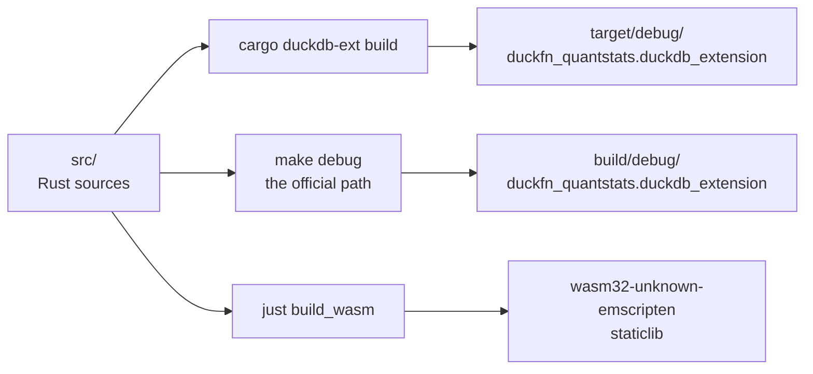
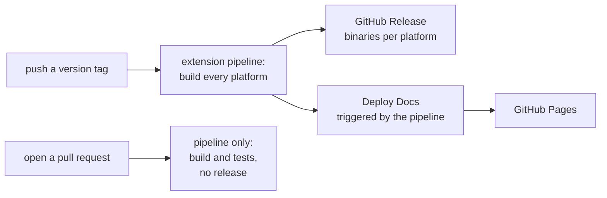

# Build and release

## Two build paths

Both are kept in sync; use whichever is faster for what you are doing.

```shell
cargo duckdb-ext build   # fast loop, no make
# -> target/debug/duckfn_quantstats.duckdb_extension

make configure           # once: builds configure/venv (Python + the sqllogictest runner)
make debug               # the official template path, also what CI runs
# -> build/debug/extension/duckfn_quantstats/duckfn_quantstats.duckdb_extension
```

`make release` is the optimized version of the same flow. On Windows `make` has to run inside Git
Bash.

Either path lands a loadable extension:



## Justfile

| Command | What it does |
| --- | --- |
| `just build` | `cargo duckdb-ext build` |
| `just sql "SELECT …"` | Build, then run one statement and exit |
| `just repl` | A DuckDB REPL with the extension loaded |
| `just lint` | `cargo clippy --all-targets -- -D warnings` |
| `just test` | The official build and the sqllogictest run |
| `just docs_csv` | Export the function descriptions to `target/function_descriptions.csv` |
| `just docs_build` / `just docs_start` | Build / serve this documentation site |
| `just release_*` | The release flow below |

## Release flow

A release is four steps, and only the second one is manual:

| Step | Command |
| --- | --- |
| 0. Pre-flight | `just release_check` (clippy + build); `just test` when the change warrants it |
| 1. Bump the version | `just release_bump {{EXTENSION_VERSION}}` |
| 2. Commit and tag | `git commit …` then `just release_tag {{EXTENSION_VERSION}}` |
| 3. Watch CI | `just release_ci`, then `gh run watch <run-id>` |
| 4. Next development version | `just release_dev 0.1.1-dev.0` |

The version lives in `Cargo.toml` (`[package] version`) and nowhere else:
`scripts/release.sh bump` rewrites that one line (only that line — this manifest also holds
`quantstats-rs = "<version>"`, which must not be touched), updates the occurrences in the docs and the
CI comments, syncs `Cargo.lock` and fixes `docs/extension-version.ts`, which is where the documentation
site gets the version number it prints. The tag has to match `Cargo.toml`, because cargo writes the
version into the built extension — a mismatch would publish a release claiming another version.

Only real releases get a tag. A version like `0.1.1-dev.0` stays on the branch: no tag, no release, no
site deployment.

### What a tag triggers

Pushing `v*.*.*` starts **Main Extension Distribution Pipeline** — it builds the extension for every
supported platform, runs the tests, then creates (or updates) a GitHub Release for that tag with the
built binaries attached as `<extension>-<arch>.duckdb_extension` (the wasm ones as
`.duckdb_extension.wasm`). Release notes are the commits since the previous version tag.

**Deploy Docs** is not started by the tag but by that pipeline *finishing*: it builds `docs/` and
publishes it to GitHub Pages (it waits for the release, which the site then preloads). It needs the
one-time *Settings → Pages → Source: GitHub Actions* setting.

Pull requests run the build and the tests only; publishing is gated on the ref being a version tag.

What a pushed version tag sets off:



### Installing a release

```sql
LOAD 'https://github.com/shijianjs/duckfn-quantstats/releases/latest/download/duckfn_quantstats-windows_amd64.duckdb_extension';
```

A locally built extension needs `duckdb -unsigned`, and so does a released file a user downloads,
because it is not signed by DuckDB's distribution key. That is what the
[community-extension](../publishing/community-extension.md) route fixes: once registered, `INSTALL … FROM community`
fetches a signed build for the user's platform.

## Version matrix

This extension stays inside the **stable region of DuckDB's C API** (`USE_UNSTABLE_C_API=0` in the
`Makefile`), so the version its metadata carries is a floor rather than an exact match: a build made
against v1.5.5 loads into a 1.5.6 engine and passes the whole sqllogictest suite. A pin therefore does
not have to chase every upstream DuckDB release — it records which release the build and the tests
rest on, and which engine the documentation site's WebAssembly runtime has to be:

| Extension | DuckDB (built and tested against) | `@duckdb/duckdb-wasm` |
| --- | --- | --- |
| v0.1.0 | v1.5.5 | 1.33.1-dev64.0 |
| v0.2.0 | v1.5.6 | 1.33.1-dev65.0 |

Add a row on every release; the last row is the current one.

- **DuckDB** is `duckdb_version` in `MainDistributionPipeline.yml` (with its `DUCKDB_VERSION`, which
  also names the release assets) and `TARGET_DUCKDB_VERSION` in the `Makefile` — they move together.
  It is where the headers come from and the number written into the extension's metadata
  (`append_extension_metadata.py -dv`, plus `DUCKDB_EXTENSION_MIN_DUCKDB_VERSION` to cargo), so the
  engine only has to be *at least* that. Nothing in the built extension reads the engine's exact version
  while the unstable region is off: quack-rs' slot-layout guard returns `StableOnly` before it ever asks
  (`quack-rs/src/abi.rs`), which is why the `QUACK_RS_TARGET_DUCKDB_VERSION` export is gone from the
  `Makefile`.
- **Locally, moving the pin is not enough**: `configure/venv` is a one-time directory stamp, so `make`
  never refreshes the test runner inside it. After a bump, upgrade it in place
  (`configure/venv/Scripts/python -m pip install --upgrade "duckdb==<new version>"`, `bin/python3` on
  other platforms) — otherwise the freshly built extension is refused by the stale runner.
- **`@duckdb/duckdb-wasm`** is the dev build whose *bundled* engine is that same DuckDB (the two are
  unrelated version numbers). The docs kit pins it — 0.4.0 pins `1.33.1-dev64.0`, i.e. DuckDB v1.5.5 —
  so `docs/package.json` carries an `overrides` entry that moves it to the matching build until a kit
  release catches up (see `docs/README.md`, *Preloaded extensions*).
- To find out which engine a build really bundles, ask it: `duckdb-node-blocking.cjs` inside the
  package runs one `SELECT version()` under Node, no browser needed.

## WebAssembly

```shell
just config_env   # once: pin the toolchain and add the wasm32-unknown-emscripten target
just build_wasm
```

The wasm build goes through `src/wasm_lib.rs`, a `staticlib` mirror of `src/lib.rs`. The two crate roots
must always declare the same set of `mod`s, and platform-specific dependencies belong under
`[target.'cfg(…'.dependencies]` in `Cargo.toml` so the wasm target does not pay for them (some crates
do not compile for emscripten at all). What the extension's wasm build does and does not do is in
[Output and browser](../../guide/output-and-browser.md) and [Design
notes](../architecture/design-notes.md).
