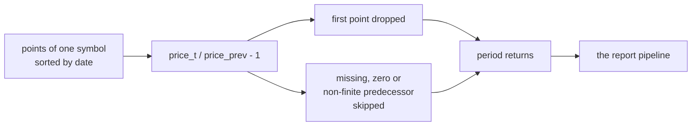

# Price (or NAV) series

`qs_html_reports_by_prices` takes **prices** — NAVs count too — not percentage changes. The value
column is called `price`, borrowing Python quantstats' vocabulary: it lumps this kind of input under
"prices" and runs `pct_change` on anything that looks like a price series. **A NAV is not strictly a
price**, but quantstats does not distinguish either, so one key takes in all of these level values and
users never have to wonder which one to fill.

## The conversion rules

- the points of each symbol are sorted by `date`, then each becomes `price_t / price_{t-1} - 1`;
- the first point of a symbol has no predecessor and is dropped;
- a point whose predecessor is missing, zero or not finite is **skipped** (the same "skip it"
  semantics as a NULL row: no error and no `inf`/`NaN` inside the series); skipping affects only that
  point, the next one is still compared with its own predecessor;
- an instrument with nothing left after the differencing simply **does not appear in the result**;
- the benchmark side goes through the same differencing, except that an empty result is an **error**
  there (the benchmark was explicitly configured);
- a symbol should hold one point per date, otherwise the difference describes the movement within that
  date.

Each symbol's points go through this before a report sees them:



## Why it needs its own name

`(symbol, date, price, options)` and `(symbol, date, period_return, options)` have exactly the same
type sequence (`VARCHAR, DATE, DOUBLE, STRUCT`), so one name could not dispatch them — hence the
second name. Everything else (a whole long table per call, grouping by symbol, the benchmark being a
symbol of that same table, the result shape) is identical to
[`qs_html_reports`](./functions.md).

## Writing the equivalent in SQL

Doing it by hand is noticeably clumsier: a window function **cannot** appear inside an aggregate call
(DuckDB reports `aggregate function calls cannot contain window function calls`), so the returns have
to be computed in a subquery first. Both blocks below produce the same reports from the same prices:

```sql {"type":"duckfn","show":"table"}
-- By hand: an extra CTE, and it is easy to get PARTITION BY / ORDER BY wrong
WITH prices AS (
    SELECT * FROM read_csv('https://shijianjs.github.io/duckfn-quantstats/demo/prices.csv')
),
returns AS (
    SELECT symbol, date,
           price / lag(price) OVER (PARTITION BY symbol ORDER BY date) - 1.0 AS period_return
    FROM prices
)
SELECT (r).symbol, (r).benchmark, length((r).html) AS html_bytes
FROM (
    SELECT unnest(qs_html_reports(
               symbol, date, period_return,
               {'benchmark': ['SPX'], 'title': symbol, 'strategy_title': symbol}
               ::qs_html_report_options)) AS r
    FROM returns
)
ORDER BY (r).symbol;
```

```sql {"type":"duckfn","show":"table"}
-- With the shortcut: prices go straight in, the symbol column does the grouping,
-- and the first point of each symbol is dropped for you
WITH prices AS (
    SELECT * FROM read_csv('https://shijianjs.github.io/duckfn-quantstats/demo/prices.csv')
)
SELECT (r).symbol, (r).benchmark, length((r).html) AS html_bytes
FROM (
    SELECT unnest(qs_html_reports_by_prices(
               symbol, date, price,
               {'benchmark': ['SPX'], 'title': symbol, 'strategy_title': symbol}
               ::qs_html_report_options)) AS r
    FROM prices
)
ORDER BY (r).symbol;
```
