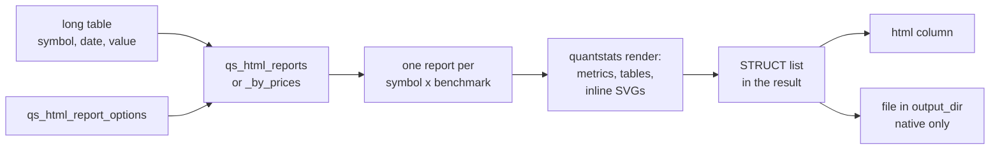

# Introduction

`duckfn_quantstats` turns a DuckDB table of prices or periodic returns into **one complete quantstats
HTML report per instrument** — the tearsheet you would otherwise generate from a Python notebook:
equity curve, drawdown, rolling Sharpe, the full metrics table, the benchmark column, all the plots.
One `SELECT` produces the whole set, and each report comes back as a row you can write to disk, open
in a browser, or read straight out of the result.

It is a **DuckDB extension**, so there is nothing to add on top of DuckDB: no `pip install
quantstats`, no Python, no notebook. One `INSTALL` brings it to every platform DuckDB ships on, and
to DuckDB-Wasm in the browser; from then on it is plain SQL, whether you send it from the CLI,
Python, Java/JVM, Node or R.

```sql
INSTALL duckfn_quantstats FROM community;   -- once; needs network
LOAD duckfn_quantstats;                     -- afterwards, this is all a session needs
```

:::tip[DuckDB 1.3 or newer]
The extension is built against DuckDB 1.5.5 headers, but it stays inside the stable region of DuckDB's
C API: the version it carries is a floor rather than an exact match, so one binary serves a whole
range of engines. It was measured on 1.3.2, 1.4.0, 1.4.5, 1.5.0, 1.5.5 and 1.5.6, where it loads and
runs; 1.2 and older are not supported.
:::

## The two functions

Two aggregate names, **one signature each**:

| Signature | Input | Returns |
| --- | --- | --- |
| `qs_html_reports(symbol, date, period_return, options)` | return series | `STRUCT(symbol, benchmark, strategy_title, benchmark_title, html, file_path)[]` |
| `qs_html_reports_by_prices(symbol, date, price, options)` | price/NAV series | the same; returns are derived inside the function |

There is **no `GROUP BY`** in SQL: the `symbol` column is the grouping key, so one call over a whole
table yields one report per instrument, and naming a benchmark — another symbol of that same table —
yields one report per instrument *and* benchmark.

One call runs the whole pipeline:



The block below runs right here in your browser, over the [demo
snapshot](https://shijianjs.github.io/duckfn-quantstats/demo/prices.csv) that every example in these
docs reads: 1435 trading days of `GOOGL`, `MSFT` and the S&P 500 index (`SPX`):

```sql {"type":"duckfn","show":"table"}
WITH prices AS (
    SELECT *
    FROM read_csv('https://shijianjs.github.io/duckfn-quantstats/demo/prices.csv')
)
SELECT (r).symbol, (r).benchmark, (r).benchmark_title, length((r).html) AS html_bytes
FROM (
    SELECT unnest(qs_html_reports_by_prices(
               symbol, date, price,
               {'benchmark': ['SPX'],
                'benchmark_title': ['S&P 500'],
                'title': symbol,
                'strategy_title': symbol}::qs_html_report_options)) AS r
    FROM prices
)
ORDER BY (r).symbol;
```

Two rows out, one per instrument — `SPX` is input only: it is the benchmark of both reports and gets
none of its own. `html` holds the whole self-contained tearsheet, and `file_path` is where it was
written if you asked for that.

## Writing them out

Every report can be written to a file, with a name the function generates, next to the query that
produced it:

```sql
WITH prices AS (
    SELECT *
    FROM read_csv('https://shijianjs.github.io/duckfn-quantstats/demo/prices.csv')
)
SELECT (r).symbol, (r).file_path
FROM (
    SELECT unnest(qs_html_reports_by_prices(
               symbol, date, price,
               {'benchmark': ['SPX'],
                'benchmark_title': ['S&P 500'],
                'title': symbol,
                'strategy_title': symbol,
                'output_dir': './'}::qs_html_report_options)) AS r
    FROM prices
)
ORDER BY (r).symbol;
```

The write is a plain local one, so `output_dir` is an ordinary directory path. This is also the one
demonstration on this page that only works on a native build: a **wasm build writes no files** — it runs
the same query, but there the file operation is skipped, so every `file_path` is `NULL` (that is why the
block is a plain listing rather than a runnable one). The reason is a limitation of the platform, not of
the extension: DuckDB-Wasm's file system reports every path as present, even one that does not exist, so
there is no trustworthy answer to "is this name free" and the never-overwrite guard could not be kept.
On your own machine the files appear in `./`.

On a desktop, `open_in_browser` saves you the trip to the file manager, but it needs a browser process
to launch, so a wasm build ignores it (`open_in_browser` is documented on
[Output and browser](./guide/output-and-browser.md)):

```sql
-- Not runnable here: on wasm there is no browser process to hand the file to.
SELECT unnest(qs_html_reports_by_prices(
           symbol, date, price,
           {'benchmark': ['SPX'], 'title': symbol, 'open_in_browser': true}::qs_html_report_options)) AS report
FROM read_csv('https://shijianjs.github.io/duckfn-quantstats/demo/prices.csv');
```

## In another language

Reports are English by default; the `lang` option translates the report's own fixed texts (headings,
metric names, chart titles, months, the legend) and hangs a short note on each of them, which the browser
shows as its native tooltip. `en`, `zh-CN`, `ja`, `de`, `fr` and `es` are built in, and
`qs_set_translation` / `qs_list_translations` rewrite the table at run time — see
[Translation](./guide/translation.md).

## Where to go next

- [Quick start](./getting-started/quick-start.md) — install it and produce the first reports.
- [Functions](./guide/functions.md) — the two names, the result shape, the benchmark semantics.
- [Options](./guide/options.md) — every field of `qs_html_report_options`.
- [Price (or NAV) series](./guide/price-series.md) — the differencing rules of the price branch.
- [Output and browser](./guide/output-and-browser.md) — `output_dir`, the generated file names,
  `open_in_browser`.
- [Translation](./guide/translation.md) — `lang`, the notes, and the translation table.
- [Error paths](./guide/error-paths.md) — what a failure looks like.

Everything about building, testing or publishing the extension itself is under
[Development guide](./development-guide/architecture/project-structure.md) at the end of the sidebar —
using it never requires any of that.
