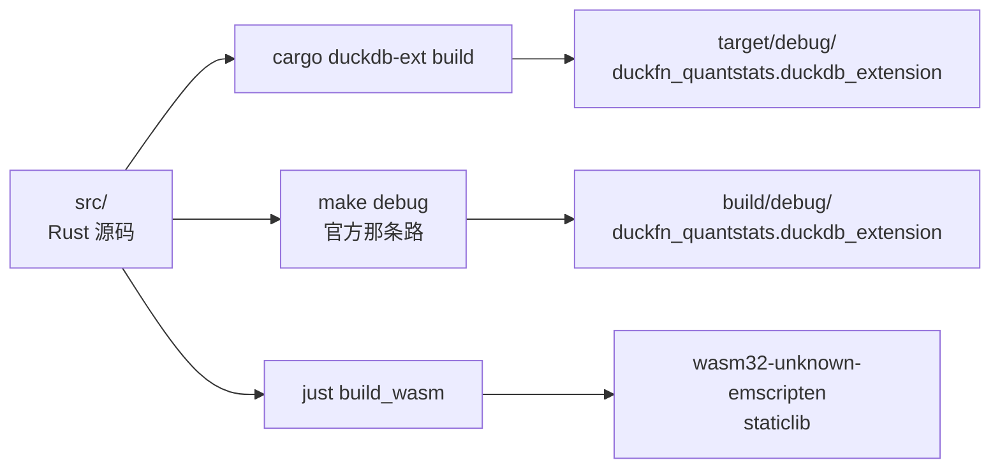
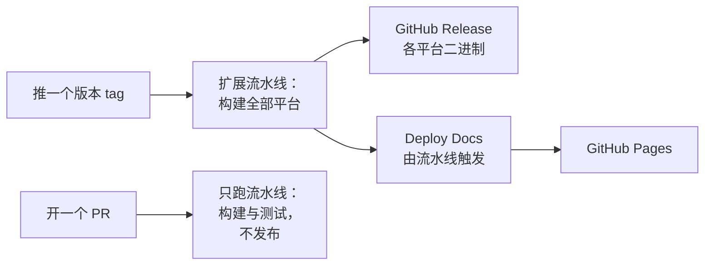

# 构建与发版

## 两条构建路径

两条保持同步，按当下哪条快用哪条。

```shell
cargo duckdb-ext build   # 快速迭代，不用 make
# -> target/debug/duckfn_quantstats.duckdb_extension

make configure           # 只做一次：建 configure/venv（Python + sqllogictest 运行器）
make debug               # 官方模板那条路，CI 也走它
# -> build/debug/extension/duckfn_quantstats/duckfn_quantstats.duckdb_extension
```

`make release` 是带优化的同一套流程。Windows 上 `make` 需要在 Git Bash 里跑。

两条路都能得到可加载的扩展：



## Justfile

| 命令 | 做什么 |
| --- | --- |
| `just build` | `cargo duckdb-ext build` |
| `just sql "SELECT …"` | 构建后跑一条语句就退出 |
| `just repl` | 扩展已加载的 DuckDB REPL |
| `just lint` | `cargo clippy --all-targets -- -D warnings` |
| `just test` | 官方构建 + sqllogictest |
| `just docs_csv` | 导出函数描述到 `target/function_descriptions.csv` |
| `just docs_build` / `just docs_start` | 构建 / 本地预览本站 |
| `just release_*` | 下面的发版流程 |

## 发版流程

一次发版四步，只有第二步是手工的：

| 步骤 | 命令 |
| --- | --- |
| 0. 前置检查 | `just release_check`（clippy + build）；改动够大时再 `just test` |
| 1. 提升版本号 | `just release_bump {{EXTENSION_VERSION}}` |
| 2. 提交并打 tag | `git commit …` 后 `just release_tag {{EXTENSION_VERSION}}` |
| 3. 查看 CI | `just release_ci`，然后 `gh run watch <run-id>` |
| 4. 切开发版本 | `just release_dev 0.1.1-dev.0` |

版本号只写在 `Cargo.toml`（`[package] version`）里：`scripts/release.sh bump` 只改那一行
（本清单里还有 `quantstats-rs = "<版本>"`，不能一并改掉），同时更新文档与 CI 注释里的出现处、同步
`Cargo.lock`，并改写 `docs/extension-version.ts` —— 文档站展示的版本号就取自那里。tag 必须与 `Cargo.toml`
一致：cargo 会把版本号写进构建出的扩展里，对不上就会发出一个自称别的版本的 Release。

只有**正式版本**才打 tag。`0.1.1-dev.0` 这类版本留在分支上：不打 tag、不发布、也不部署站点。

### 推 tag 会触发什么

推送 `v*.*.*` 会启动 **Main Extension Distribution Pipeline** —— 它为各平台构建扩展、跑测试，然后
为该 tag 创建（或更新）GitHub Release，把构建出的二进制挂上去，命名为
`<扩展名>-<架构>.duckdb_extension`（wasm 则是 `.duckdb_extension.wasm`）。Release 说明是上一个版本
tag 以来的提交。

**Deploy Docs** 不是由 tag 启动的，而是由那条流水线**跑完**触发：它构建 `docs/` 并发布到 GitHub
Pages（会等 Release 就绪，站点预加载的正是它）。需要一次性设置
*Settings → Pages → Source: GitHub Actions*。

PR 只跑构建与测试；发布由「ref 是版本 tag」这条门槛决定。

推送一个版本 tag 会启动这些：



### 安装发布产物

```sql
LOAD 'https://github.com/shijianjs/duckfn-quantstats/releases/latest/download/duckfn_quantstats-windows_amd64.duckdb_extension';
```

本地构建的产物要 `duckdb -unsigned`；用户下载的发布产物同样要，因为它没有 DuckDB 发行密钥的签名。
[社区扩展](../publishing/community-extension.md)那条路解决的就是这件事：注册之后，
`INSTALL … FROM community` 会取回与用户平台匹配的签名产物。

## WebAssembly

```shell
just config_env   # 一次性：固定工具链并装 wasm32-unknown-emscripten target
just build_wasm
```

wasm 构建走 `src/wasm_lib.rs`，它是 `src/lib.rs` 的 `staticlib` 镜像。两个 crate root 必须始终声明同一组
`mod`；平台相关依赖挂在 `Cargo.toml` 的 `[target.'cfg(…'.dependencies]` 下，别让 wasm 目标替它们付编译
成本（有些 crate 在 emscripten 上根本编不过）。本扩展的 wasm 构建做什么、不做什么，见
[落盘与浏览器](../../guide/output-and-browser.md)与[设计取舍](../architecture/design-notes.md)。
