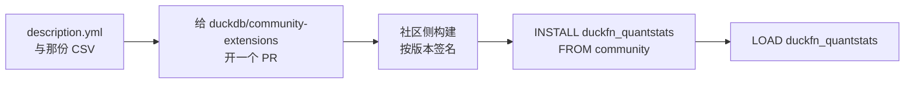

# 社区扩展

把扩展注册进 [duckdb/community-extensions](https://github.com/duckdb/community-extensions)，就把
「从 GitHub Release 下载一个文件」变成了：

```sql
INSTALL duckfn_quantstats FROM community;   -- 只需一次，需要网络
LOAD duckfn_quantstats;
```

社区构建带签名、并且与用户的 DuckDB 版本匹配，所以不再需要 `-unsigned`。注册本身是一个 PR，
往仓库里加**两个文件**：

| 本仓 | 社区仓 |
| --- | --- |
| `community-extension/description.yml` | `extensions/duckfn_quantstats/description.yml` |
| `community-extension/docs/function_descriptions.csv` | `extensions/duckfn_quantstats/docs/function_descriptions.csv` |

目录名必须与 `extension.name` 逐字相同 —— 社区仓的 `scripts/build.py` 会检查这一点。

注册完成之后，下载就变成一句 SQL：



## CSV

社区扩展页那张 `Added Functions` 表里，函数的描述、注释与示例只有一个来源，就是这份 CSV：
DuckDB 的 C 扩展 API 没法设置它们。文本来自 `#[duck_*]` 属性的 `description` / `comment` / `example`，
所以它紧挨着被描述的函数：

```rust
#[duck_aggregate_function(
    description = "Renders one quantstats HTML report per symbol from a long table of periodic returns",
    comment = "…",
    examples = ["SELECT unnest(qs_html_reports(…)) FROM daily_returns", "…"]
)]
```

这些属性一改就重新生成并拷过去：

```shell
just docs_csv
cp target/function_descriptions.csv community-extension/docs/function_descriptions.csv
```

多条示例导出时用 `"; "` 拼接、去掉结尾分号；换行会压成空格，因为目标是 Markdown 表格。照「一句一条完整
SQL」写，一律英文。完整说明见[函数描述](./function-descriptions.md)。

## `description.yml`

这个文件会被原样复制到社区仓，所以里面只有字段、没有注释。需要拿主意的字段：

| 字段 | 填什么 |
| --- | --- |
| `extension.name` | `duckfn_quantstats`，与目录名、入口符号一致。 |
| `extension.description` | 一行说明，展示在扩展列表里。 |
| `extension.version` | 已发布的版本号，不带 `-dev.N` 后缀。 |
| `extension.language` / `build` | `Rust` 与 `cargo`。 |
| `extension.license` | `MIT`（仓库的 `LICENSE`）。注意社区**文档页**把它写成 `licence`，真正的 schema 是 `license`。 |
| `extension.requires_toolchains` | `"rust;python3"` —— 与 CI 工作流传给 `extra_toolchains` 的值一致。 |
| `extension.maintainers` | 你的 GitHub 账号。 |
| `repo.github` | `shijianjs/duckfn-quantstats`。 |
| `repo.ref` | 该发布版本对应的**提交 SHA**（40 位）—— `git rev-list -n 1 v0.1.0` —— 不是 `main`，也不是 tag 名。注册指向不可变的代码，从分支构建出来的东西会自称开发版本。 |
| `docs.hello_world` | 一个可运行示例，会被渲染成代码块。不要在这里写 `INSTALL` / `LOAD`：页面自己会加。 |
| `docs.extended_description` | 函数表周围的说明文字。 |

`community-extension/AGENTS.md` 里对每个字段的来历与提交步骤有更详细的说明。

## 提交

```shell
# 1. 在你 fork 的 duckdb/community-extensions 克隆里
git checkout -b add-duckfn-quantstats

# 2. 把两个文件放到位
mkdir -p extensions/duckfn_quantstats/docs
cp <本仓>/community-extension/description.yml extensions/duckfn_quantstats/
cp <本仓>/community-extension/docs/function_descriptions.csv extensions/duckfn_quantstats/docs/

# 3. 提交、推送、开 PR
git add extensions/duckfn_quantstats
git commit -m "Add duckfn_quantstats: …"
gh pr create --repo duckdb/community-extensions --base main --head <你>:add-duckfn-quantstats
```

维护者会跑构建工作流（首次贡献者的运行会显示为 `action_required`，等有人批准 —— 这是正常的）。
合并之后 `INSTALL duckfn_quantstats FROM community` 就能用了。

## 让它跟上发版

`repo.ref` 与 `extension.version` 都钉在某一次发布上。每次发版之后，在本仓的 `community-extension/`
里把这两个都更新，拷进社区仓，推到同一个 PR 分支（或者新开一个）。`just release_bump` 已经会改写
`version` 字段；提交 SHA 那一段要人工填。
