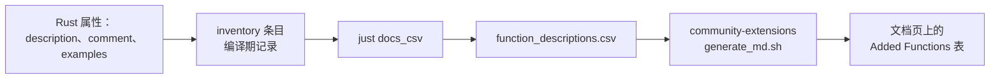

# 函数描述

DuckDB 的 C 扩展 API **没有**设置函数描述与示例的接口：`duckdb_scalar_function_set_name`、
`_set_return_type`、`_set_varargs`、`_set_volatile`…… 就到这儿，没有 `_set_description`，
也没有 `_add_example`。所以社区扩展页
（[扩展列表](https://duckdb.org/community_extensions/list_of_extensions)）
上那张 `Added Functions` 表要是没人帮忙，就只是一列光秃秃的函数名。

这份文本紧挨着被描述的函数，写在 `#[duck_*]` 属性上（本扩展的两处分别在
`functions/aggregate_html/html_returns.rs` 与 `html_prices.rs`）：

```rust
#[duck_aggregate_function(
    description = "Renders one quantstats HTML report per symbol from a long table of periodic returns",
    comment = "Groups by symbol internally, so the SQL needs no GROUP BY …",
    examples = ["SELECT unnest(qs_html_reports(…)) FROM daily_returns", "…"]
)]
```

从属性到发布出去的那张表，链路是这样的：



三个键都可选（`example` 单条、`examples` 多条，二者互斥），**不参与注册**：宏只把它们连同注册名收进
inventory。导出：

```shell
just docs_csv                                           # -> target/function_descriptions.csv
cargo run --bin duckfn -- function_descriptions --all    # -> target/function_descriptions_all.csv
                                                         #    （含还没写描述的函数，当清单用）
```

这一步不加载扩展、不查 catalog、也不需要 DuckDB 在场：纯粹读编译期记下来的东西，路径固定为项目的
`target/` 下。`src/bin/duckfn.rs` 里那句 `#[path = "../extension/mod.rs"] mod extension;` 是必需的 ——
inventory 的静态构造器只在**真正被链接进最终二进制**的目标文件里生效，改成 `use duckfn_quantstats::…`
的话 CSV 会静默变空（不报错，只是没内容）。

文本本身还有三条规矩：多条示例导出时用 `"; "` 拼接、每条去掉结尾分号；换行会压成一个空格（生成页是
Markdown 表格，单元格里的换行会断行）；逗号、引号与非 ASCII 原样通过。所以照「一句一条完整 SQL」
写即可。文案一律英文 —— 它会被原样贴到文档页上。

发社区扩展时，把这份 CSV 放进 `community-extensions` 仓的
`extensions/duckfn_quantstats/docs/function_descriptions.csv`（它由那个仓的 `generate_md.sh` 按
`function_name` 左连接覆盖函数表）；本仓不必留副本，改完代码重新生成即可。见
[社区扩展](./community-extension.md)。
