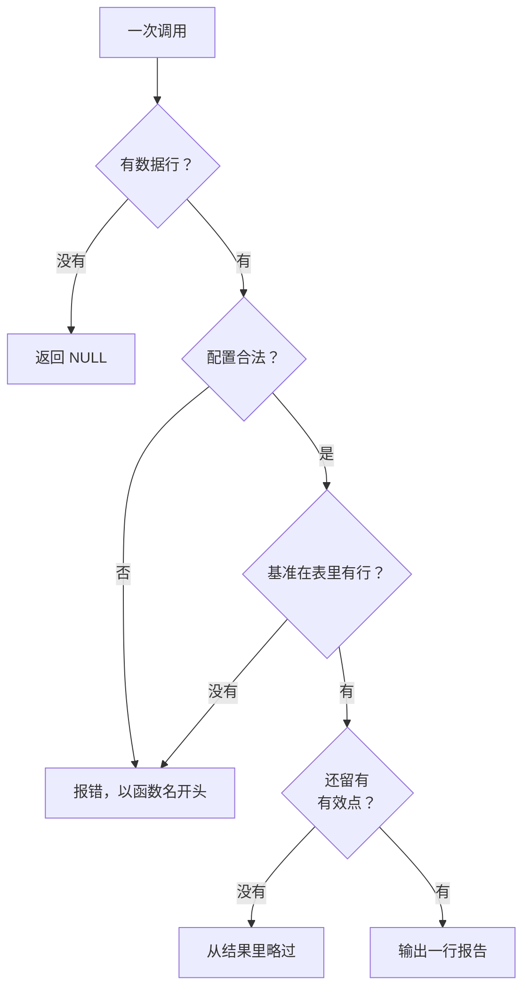

# 错误路径

| 情况 | 行为 |
| --- | --- |
| 一行都没有，或没有任何标的能出报告 | 返回 `NULL` |
| 某个标的差分/构造后没有有效点 | 该标的从结果里略过 |
| `benchmark` 指的 symbol 在表里没有行 | 报错 `no row for the benchmark symbol '…'` |
| `benchmark` 列表在各标的之间不一致（元素或顺序不同） | 报错 `every symbol must use the same benchmark list` |
| `benchmark` 列表里有空串 / NULL 元素 / 重复项 | 报错 `must not contain an empty string` / `… a NULL element` / `lists '…' twice` |
| `benchmark_title` 缺项 / 空串 / NULL / 多出来 | **不算错误**：缺项退回对应的基准 symbol，多余项忽略 |
| 价格路径：基准差分不出收益率（有效点不足两个） | 报错 `produced no returns` |
| `periods_per_year = 0` | 报错 `periods_per_year must be greater than 0` |
| `output_dir = ''` | 报错 `output_dir must not be an empty string` |
| `output_dir` 里有 NUL 字节 | 报错 `contains a NUL byte` |
| `output_dir` 写不进去（目录不存在、路径不可写等） | 报错 `cannot write the report to '<路径>': …`，带路径 |
| `open_in_browser` 配的 `output_dir` 不是本地路径（`s3://…`、`memory://…`） | 报错 `only local file paths can be opened in a browser` |
| **wasm 构建**（本站那些浏览器里跑的块）写了 `output_dir` | **不算错误**：什么也不写，`file_path` 是 `NULL` |
| `lang` 在翻译表里没有条目 | 报错 `no translations for language '…'`，并指向 `qs_list_translations()` |
| `qs_set_translation` 的 `key` 不在目录里 | 报错 `unknown key '…'` |
| `qs_set_translation` 的语言标签是空串 | 报错 `language must not be an empty string` |
| `qs_set_translation` 列表里有 NULL 元素、缺 `key`，或同一个 `key` 出现两次 | 报错 `must not contain a NULL element` / `every entry needs a 'key'` / `key '…' appears twice in one call` |
| `qs_set_translation` 删一个本来就不存在的 key 或语言 | **不算错误**：返回 `false`（表没有变化） |

报错信息一律以注册的函数名开头（`qs_html_reports: …`），所以一眼能看出是哪个函数的问题。

哪种失败会以什么形式出现：



## 最值得亲眼看的三条

下面每一块**都是故意失败的**：点 **Run**，报文会出现在原本显示结果的地方。

基准在表里不存在 —— `benchmark` 写的是 symbol，每一个都必须有对应的行：

```sql {"type":"duckfn","show":"table","expect":"error"}
WITH prices AS (
    SELECT * FROM read_csv('https://shijianjs.github.io/duckfn-quantstats/demo/prices.csv')
)
SELECT unnest(qs_html_reports_by_prices(
           symbol, date, price,
           {'benchmark': ['NDX']}::qs_html_report_options)) AS report
FROM prices;
```

配置写错是在渲染之前就拦掉的，所以不花任何代价：

```sql {"type":"duckfn","show":"table","expect":"error"}
WITH prices AS (
    SELECT * FROM read_csv('https://shijianjs.github.io/duckfn-quantstats/demo/prices.csv')
)
SELECT unnest(qs_html_reports_by_prices(
           symbol, date, price,
           {'periods_per_year': 0}::qs_html_report_options)) AS report
FROM prices;
```

基准列表里的空串是猜不过去的错误 —— 空 symbol 既当不了报告的标签，也当不了文件名：

```sql {"type":"duckfn","show":"table","expect":"error"}
WITH prices AS (
    SELECT * FROM read_csv('https://shijianjs.github.io/duckfn-quantstats/demo/prices.csv')
)
SELECT unnest(qs_html_reports_by_prices(
           symbol, date, price,
           {'benchmark': ['SPX', '']}::qs_html_report_options)) AS report
FROM prices;
```
