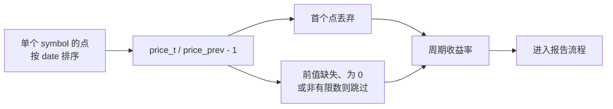

# 价格/净值序列

`qs_html_reports_by_prices` 收的是**价格、净值这类水平值**，不是百分比变化。值列叫 `price` 是照搬
Python quantstats 的词汇：它把这类输入统称 prices，内部对看起来像价格的序列自动做 `pct_change`。
**净值（NAV）严格说不是 price**，但 quantstats 也不区分，净值序列照样当 prices 喂 —— 所以这里用同一个
键收下，不用去想该填哪个。

## 换算规则

- 每个 symbol 的点先按 `date` 排序，再逐点算 `price_t / price_{t-1} - 1`；
- 每个 symbol 的第一个点没有前值，丢弃；
- 前值缺失、为 0 或不是有限数时，该点**跳过**（与「`NULL` 行跳过」同一语义，不报错、也不会往序列里塞
  `inf`/`NaN`）；跳过只影响它自己，下一个点仍然和它自己的前一个点比；
- 差分后没有任何有效点的标的**不会出现在结果里**；
- 基准侧走同一套差分规则，差别是它差分后为空时报错（那个基准是配置里明确要的）；
- 同一 symbol 内同一天只应有一个点，否则差分出来的是那一天内部的变动。

每个 symbol 的点在进入报告之前都先过这一遍：



## 为什么它必须有独立的名字

`(symbol, date, price, options)` 与 `(symbol, date, period_return, options)` 的类型序列完全一样
（`VARCHAR, DATE, DOUBLE, STRUCT`），同一个名字下无法按类型分派 —— 所以才要第二个名字。其余一切
（一次调用处理整张长表、按 symbol 分组、基准是同一张表里的一个 symbol、返回形状）都与
[`qs_html_reports`](./functions.md)相同。

## 用 SQL 自己写等价物

别扭得多：窗口函数**不能**直接写进聚合调用（DuckDB 会报
`aggregate function calls cannot contain window function calls`），必须先在一个子查询里算好收益率。
下面两块从同一份价格出发，得到的是同一批报告：

```sql {"type":"duckfn","show":"table"}
-- 自己算：多一个 CTE，而且 PARTITION BY / ORDER BY 很容易写漏
WITH prices AS (
    SELECT * FROM read_csv('https://shijianjs.github.io/duckfn-quantstats/demo/prices.csv')
),
returns AS (
    SELECT symbol, date,
           price / lag(price) OVER (PARTITION BY symbol ORDER BY date) - 1.0 AS period_return
    FROM prices
)
SELECT (r).symbol, (r).benchmark, length((r).html) AS html_bytes
FROM (
    SELECT unnest(qs_html_reports(
               symbol, date, period_return,
               {'benchmark': ['SPX'], 'title': symbol, 'strategy_title': symbol}
               ::qs_html_report_options)) AS r
    FROM returns
)
ORDER BY (r).symbol;
```

```sql {"type":"duckfn","show":"table"}
-- 用快捷方式：价格/净值直接进去，分组交给 symbol 列，每个标的的第一个点也会替你丢掉
WITH prices AS (
    SELECT * FROM read_csv('https://shijianjs.github.io/duckfn-quantstats/demo/prices.csv')
)
SELECT (r).symbol, (r).benchmark, length((r).html) AS html_bytes
FROM (
    SELECT unnest(qs_html_reports_by_prices(
               symbol, date, price,
               {'benchmark': ['SPX'], 'title': symbol, 'strategy_title': symbol}
               ::qs_html_report_options)) AS r
    FROM prices
)
ORDER BY (r).symbol;
```
