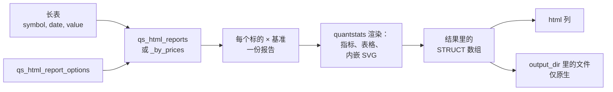

# 简介

`duckfn_quantstats` 把一张 DuckDB 的价格表或收益率表，变成**每个标的一份完整的 quantstats HTML 报告** ——
就是平时在 Python notebook 里生成的那种 tearsheet：净值曲线、回撤、滚动 Sharpe、完整的指标表、
基准列、所有图表。一条 `SELECT` 出整套，每份报告作为一行返回，可以直接落盘、用浏览器打开，或者就在
结果里读。

它是一个 **DuckDB 扩展**，所以在 DuckDB 之上不需要再加任何东西：不用装 quantstats、不用 Python、
不用 notebook。一条 `INSTALL` 就能装到 DuckDB 支持的每个平台，以及浏览器里的 DuckDB-Wasm；
之后就是纯 SQL —— 命令行、Python、Java/JVM、Node、R 发过来的查询都一样。

```sql
INSTALL duckfn_quantstats FROM community;   -- 只需一次，需要网络
LOAD duckfn_quantstats;                     -- 之后每个会话只要这一句
```

:::tip[DuckDB 1.3 及以上]
本扩展依据 DuckDB 1.5.5 的头文件构建，但只使用 DuckDB C API 的稳定区：元数据里带的是**下限**而非逐字
匹配，一份产物能服务一整段引擎版本。实测跑过 1.3.2、1.4.0、1.4.5、1.5.0、1.5.5、1.5.6；1.2 及更早不受支持。
:::

## 两个函数

两个聚合函数名字、**各一个签名**：

| 签名 | 输入 | 返回 |
| --- | --- | --- |
| `qs_html_reports(symbol, date, period_return, options)` | 收益率序列 | `STRUCT(symbol, benchmark, strategy_title, benchmark_title, html, file_path)[]` |
| `qs_html_reports_by_prices(symbol, date, price, options)` | 价格/净值序列 | 同上；函数内部先换算成收益率 |

SQL 里**不写 `GROUP BY`**：`symbol` 列就是分组依据，所以整张表一次调用就是「每个标的一份报告」；
再指名一个基准（同一张表里的另一个 symbol），就是「每个标的 × 每个基准一份」。

一次调用走完整条流水线：



下面这块在你的浏览器里就能跑，读的是本站每个示例都用的那份
[演示快照](https://shijianjs.github.io/duckfn-quantstats/demo/prices.csv)：`GOOGL`、`MSFT` 与标普 500
指数（`SPX`）各 1435 个交易日：

```sql {"type":"duckfn","show":"table"}
WITH prices AS (
    SELECT *
    FROM read_csv('https://shijianjs.github.io/duckfn-quantstats/demo/prices.csv')
)
SELECT (r).symbol, (r).benchmark, (r).benchmark_title, length((r).html) AS html_bytes
FROM (
    SELECT unnest(qs_html_reports_by_prices(
               symbol, date, price,
               {'benchmark': ['SPX'],
                'benchmark_title': ['S&P 500'],
                'title': symbol,
                'strategy_title': symbol}::qs_html_report_options)) AS r
    FROM prices
)
ORDER BY (r).symbol;
```

两行结果，一个标的一行 —— `SPX` 只作输入：它是两份报告的基准，自己不出报告。`html` 里就是那份
自包含的 tearsheet，`file_path` 则是你要求落盘时它写到了哪。

## 落盘

每份报告都可以落成一个文件，文件名由函数生成，紧挨着产生它的那条查询：

```sql
WITH prices AS (
    SELECT *
    FROM read_csv('https://shijianjs.github.io/duckfn-quantstats/demo/prices.csv')
)
SELECT (r).symbol, (r).file_path
FROM (
    SELECT unnest(qs_html_reports_by_prices(
               symbol, date, price,
               {'benchmark': ['SPX'],
                'benchmark_title': ['S&P 500'],
                'title': symbol,
                'strategy_title': symbol,
                'output_dir': './'}::qs_html_report_options)) AS r
    FROM prices
)
ORDER BY (r).symbol;
```

落盘就是一次普通的本地写入，`output_dir` 因此是一个常规目录路径。这也正是本页唯一一块**只有原生构建
才看得到效果**的示例：**wasm 构建一个文件都不写** —— 同一条查询照样跑，但那边整个跳过文件操作，于是
每一行的 `file_path` 都是 `NULL`（所以这块写成普通代码块，而不是可运行块）。这是平台的限制，不是扩展的
问题：DuckDB-Wasm 的文件系统会把任何路径都报成已存在，哪怕它并不存在，「这个文件名空着吗」因此没有可信
答案，那道「绝不覆盖已有文件」的保证也就无法兑现。在你自己的机器上，这些文件会出现在 `./`。

在桌面端，`open_in_browser` 能省掉去文件管理器里翻文件这一步；但它需要一个浏览器进程来启动，
所以 wasm 构建会忽略它（详见[落盘与浏览器](./guide/output-and-browser.md)）：

```sql
-- 这里跑不了：wasm 里没有可以把文件交给它的浏览器进程。
SELECT unnest(qs_html_reports_by_prices(
           symbol, date, price,
           {'benchmark': ['SPX'], 'title': symbol, 'open_in_browser': true}::qs_html_report_options)) AS report
FROM read_csv('https://shijianjs.github.io/duckfn-quantstats/demo/prices.csv');
```

## 换一种语言

报告缺省是英文；`lang` 配置项会把报告**自己说的那些固定文本**（分节标题、指标名、图表标题、月份、图例）
换成另一种语言，并在每一处挂一句简短说明，由浏览器用它自己的浮出提示显示出来。内置 `en`、`zh-CN`、`ja`、
`de`、`fr`、`es` 六种，`qs_set_translation` / `qs_list_translations` 可以在运行时改写这张表 —— 见
[翻译](./guide/translation.md)。

## 接下来去哪

- [快速开始](./getting-started/quick-start.md) —— 装好之后产出第一份报告。
- [函数](./guide/functions.md) —— 两个名字、返回形状、基准语义。
- [配置字段](./guide/options.md) —— `qs_html_report_options` 的每一个字段。
- [价格/净值序列](./guide/price-series.md) —— 价格路径的差分规则。
- [落盘与浏览器](./guide/output-and-browser.md) —— `output_dir`、文件命名、`open_in_browser`。
- [翻译](./guide/translation.md) —— `lang`、浮出说明与翻译表。
- [错误路径](./guide/error-paths.md) —— 出错时是什么样。

与「构建、测试、发布这个扩展本身」有关的内容都在侧边栏最后的一级目录
[开发指南](./development-guide/architecture/project-structure.md)里 —— 使用它完全不需要看那些。
